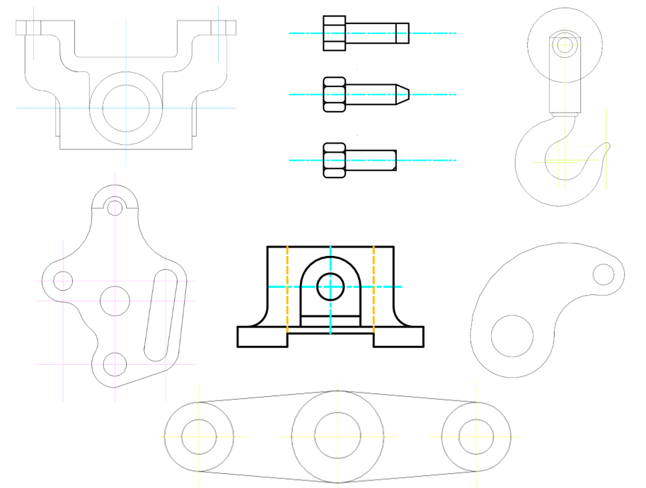
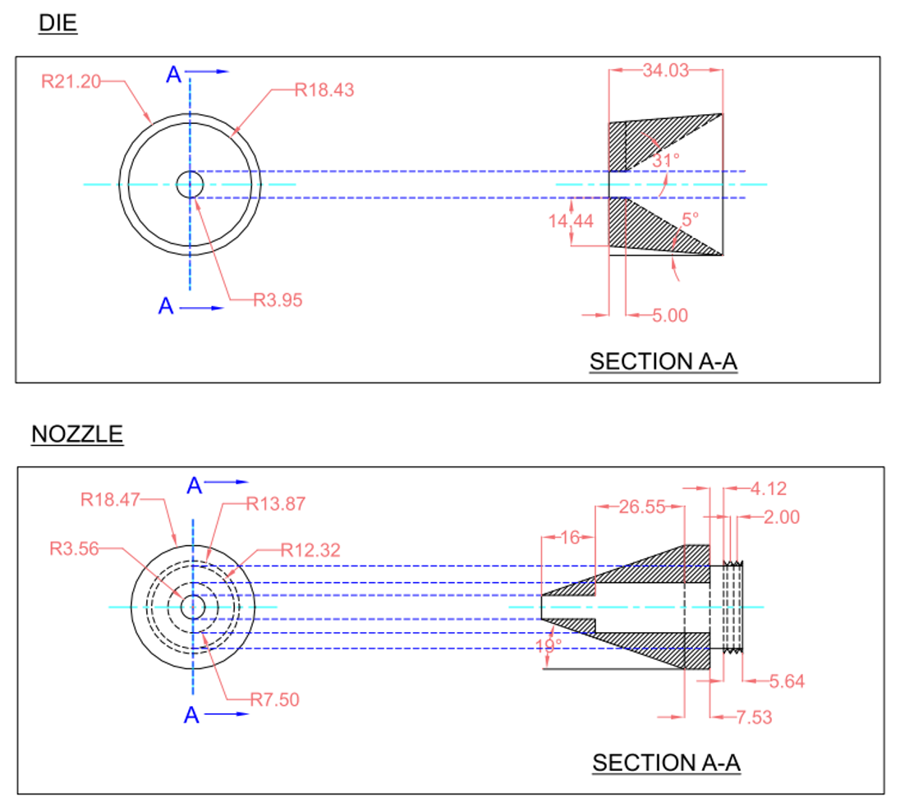
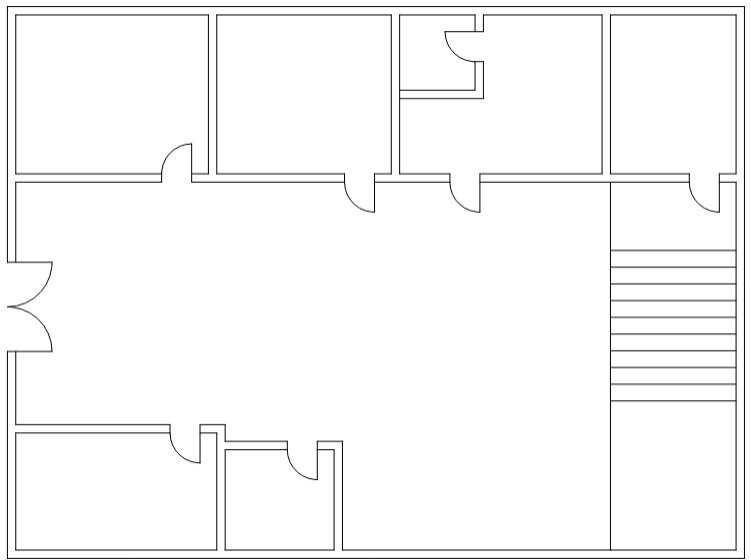

# 💼 AutoCAD Practice Drawings Portfolio

Welcome to my collection of AutoCAD practice drawings. 
This portfolio showcases a range of 2D drafting exercises covering **mechanical components**, **sectional views**, and **basic architectural layouts**.

---

## 📐 Featured Mechanical Designs

---

## ✂️ Section Views

### 🧪 **Die & Nozzle Assembly (Design 5)**
- Clear **A-A sectional cuts**.
- Shows inner structure and dimension annotations.
 

### 🔧 **Die & Nozzle Section Views** *(Design 5)*
- Demonstrates **cutaway views**, dimensions, and symmetry.
- Shows technical detail and understanding of real-world components.
 

---

## 🏠 Architectural Design

### 📏 **Basic Floor Plan** *(Design 21)*
- Displays an interior layout with:
  - Doors and walls
  - A staircase
  - Multiple rooms
- Room for improvement:
  - Add room labels, dimensions, and a title block in the future.
 

---

## 🛠 Tools Used

- **AutoCAD 2D**
- Basic use of:
  - Layers
  - Dimensions
  - Centerlines
  - Sectional views
  - Architectural elements

---

## 🔗 About This Repository

This repository is part of my learning journey in **2D Technical Drafting** using AutoCAD. The goal is to improve:
- Drawing accuracy
- Use of CAD standards
- Preparation for industry or academic projects

---

## 📬 Contact

If you have feedback or suggestions, feel free to [open an issue](https://github.com).

---

