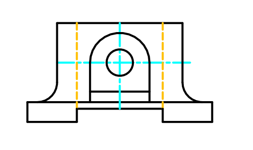
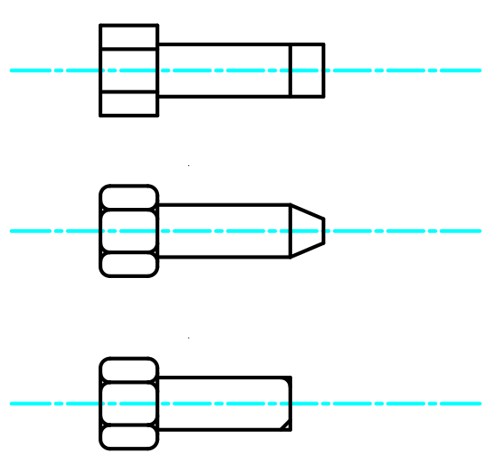

# 💼 AutoCAD Practice Drawings Portfolio

Welcome to my collection of AutoCAD practice drawings. 
This portfolio showcases a range of 2D drafting exercises covering **mechanical components**, **sectional views**, and **basic architectural layouts**.

---

## 📐 Featured Mechanical Designs

### 🔧 **1. Die and Nozzle Section Views** *(Design 5)*
- Demonstrates **cutaway views**, dimensions, and symmetry.
- Shows technical detail and understanding of real-world components.
 

### 🧲 **2. Symmetrical Mount / Casting** *(Design 6)*
- Great example of **complex geometry** and centerline usage.
 

### 🛠️ **3. Lever Arm / Connector Link** *(Design 10 & 12)*
- Illustrates functional parts that might appear in machines or assemblies.
 

### 🪝 **4. Hook and Pulley** *(Design 14)*
- Represents lifting hardware.
- Clean use of curves and alignment.
 

### 🔩 **5. Brackets and Mounting Plates** *(Designs 15, 16, 19, 20)*
- Variety of profiles including slots, holes, and asymmetrical outlines.
- Reflects realistic parts used in mechanical or manufacturing contexts.
 

### 🧱 Machined Bearing Block (New Design)
- This drawing shows a bearing or mounting block with proper use of centerlines and hidden features.
- It demonstrates understanding of technical conventions used in mechanical drafting.
  

### 🔩 Fastener Variants
- This drawing includes three types of bolts or fasteners with centerlines and precise geometry.
- Useful for demonstrating attention to engineering drawing standards.

---

## ✂️ Section Views

### 🧪 **Die & Nozzle Assembly (Design 5)**
- Clear **A-A sectional cuts**.
- Shows inner structure and dimension annotations.
 

---

## 🏠 Architectural Design

### 📏 **Basic Floor Plan** *(Design 21)*
- Displays an interior layout with:
  - Doors and walls
  - A staircase
  - Multiple rooms
- Room for improvement:
  - Add room labels, dimensions, and a title block in the future.
 

---

## 🛠 Tools Used

- **AutoCAD 2D**
- Basic use of:
  - Layers
  - Dimensions
  - Centerlines
  - Sectional views
  - Architectural elements

---

## 🔗 About This Repository

This repository is part of my learning journey in **2D Technical Drafting** using AutoCAD. The goal is to improve:
- Drawing accuracy
- Use of CAD standards
- Preparation for industry or academic projects

---

## 📬 Contact

If you have feedback or suggestions, feel free to [open an issue](https://github.com).

---

