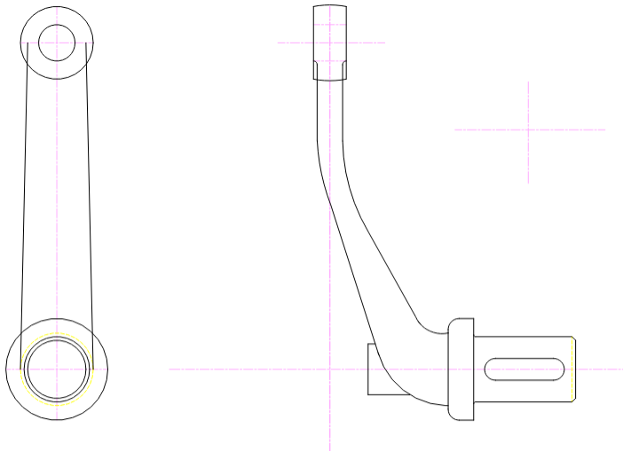
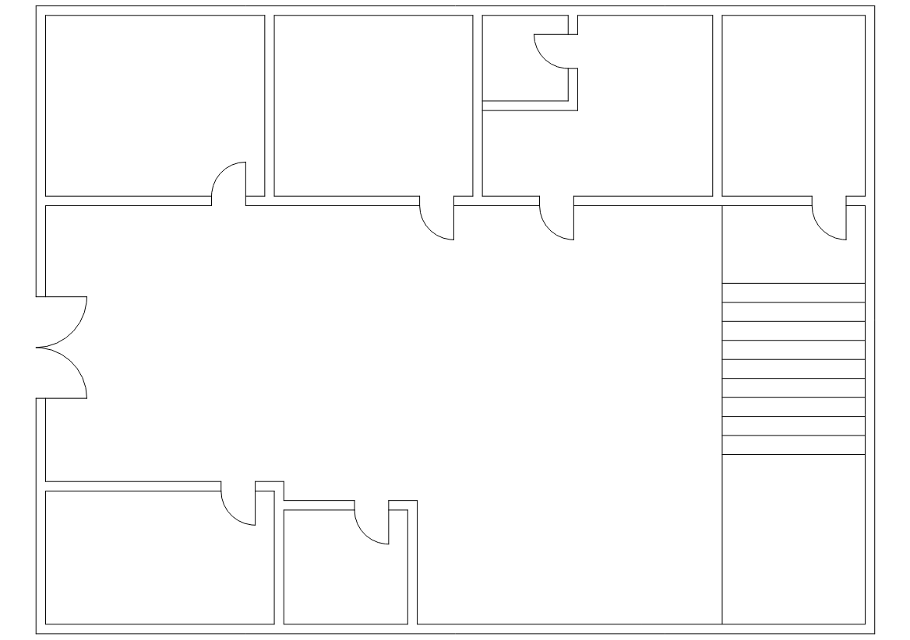

# 💼 AutoCAD Practice Drawings Portfolio

Welcome to my collection of AutoCAD practice drawings. 

This portfolio showcases a range of 2D drafting exercises covering **mechanical components**, **sectional views**, and **basic architectural layouts**.

---

## 📐 Featured Mechanical Designs

## ✂️ Section Views

#### **Die & Nozzle Section Views**
- Clear **A-A sectional cuts**.
- Shows inner structure and dimensions.
- Demonstrates **cutaway views**, dimensions, and symmetry.
 

### **Curved Lever Arm with Shaft**
- Clear front view and side view.
- Shows multiple features like slot, curves, change in direction, etc.
 

## 🏠 Architectural Design

### **Basic Floor Plan**
- Displays an interior layout with:
  - Doors and walls
  - A staircase
  - Multiple rooms
 

---

## 🛠 Tools Used

- **AutoCAD 2D**
- Basic use of:
  - Layers
  - Dimensions
  - Centerlines
  - Sectional views
  - Architectural elements

---

## 🔗 About This Repository

This repository is part of my learning journey in **2D Technical Drafting** using AutoCAD. The goal is to improve:
- Drawing accuracy
- Use of CAD standards
- Preparation for industry or academic projects

---

## 📬 Contact

If you have feedback or suggestions, feel free to [open an issue](https://github.com).

---

